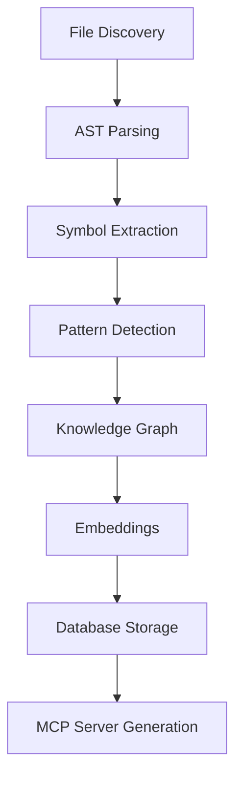
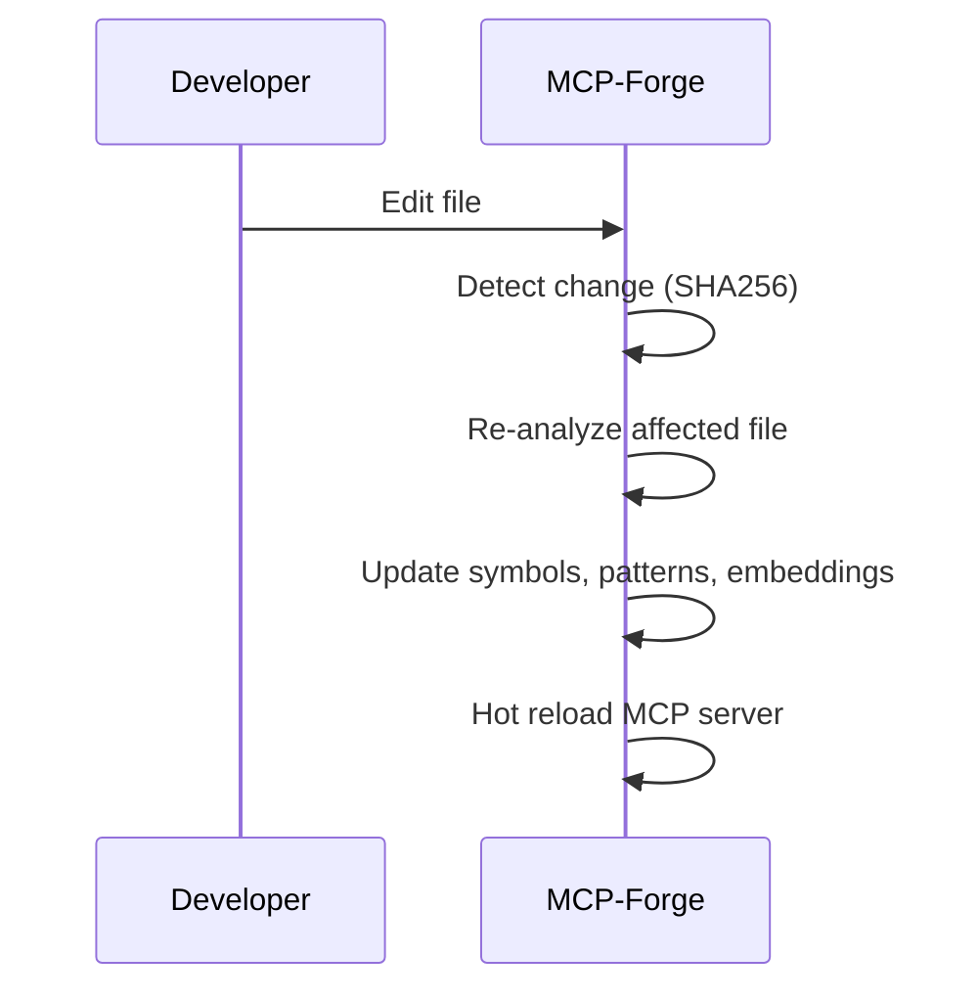
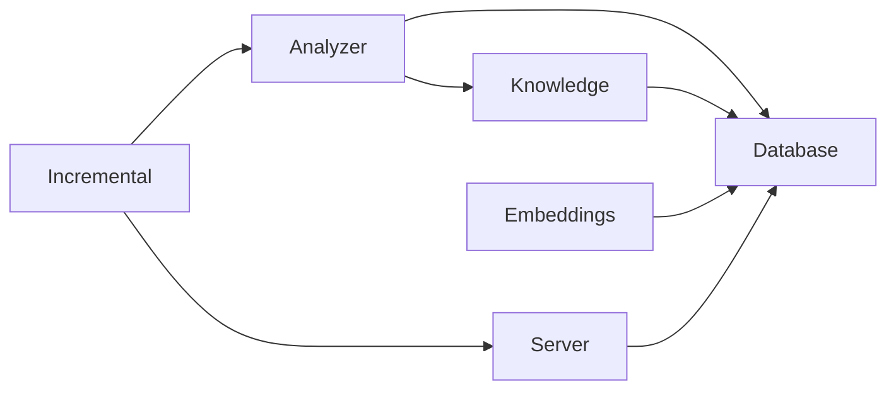

# MCP-Forge Diagrams

## Architecture Overview

```mermaid
flowchart TD
    A[File Discovery] --> B[AST Parsing]
    B --> C[Symbol Extraction]
    C --> D[Pattern Detection]
    D --> E[Knowledge Graph]
    E --> F[Embeddings]
    F --> G[Database Storage]
    G --> H[MCP Server Generation]
```

## Incremental Build Flow

```mermaid
sequenceDiagram
    participant Dev as Developer
    participant MCP as MCP-Forge
    Dev->>MCP: Edit file
    MCP->>MCP: Detect change (SHA256)
    MCP->>MCP: Re-analyze affected file
    MCP->>MCP: Update symbols, patterns, embeddings
    MCP->>MCP: Hot reload MCP server
```

## Module Relationships

```mermaid
graph LR
    Analyzer --> Knowledge
    Analyzer --> Database
    Knowledge --> Database
    Embeddings --> Database
    Server --> Database
    Incremental --> Analyzer
    Incremental --> Server
```

---

For more details, see the onboarding guide and API reference.
