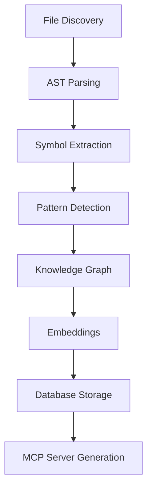
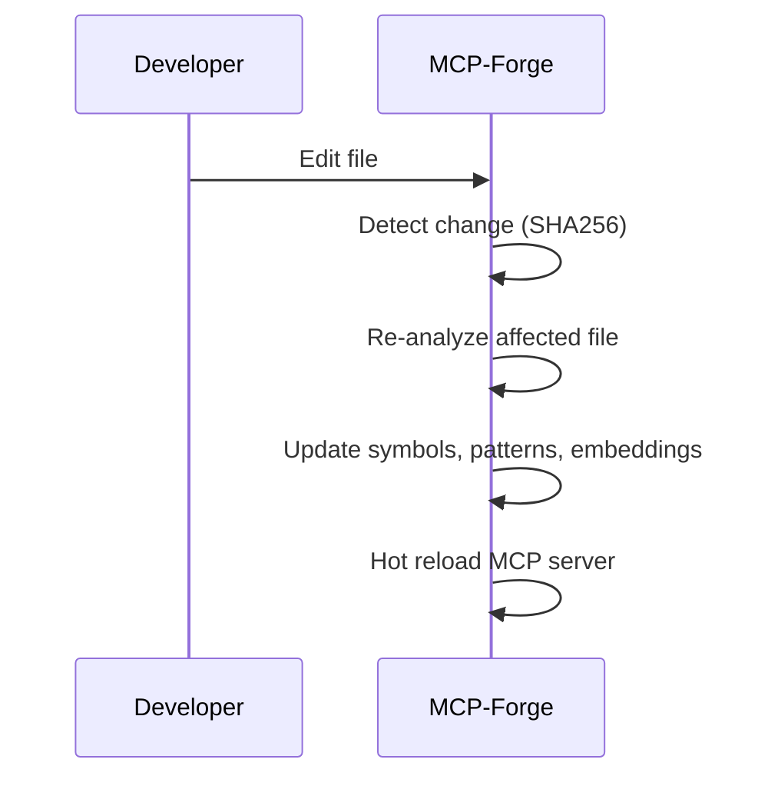

# MCP-Forge Example Workflows

## Example: End-to-End Analysis & Server Generation

```rust
use mcp_forge::analyzer::{CodeParser, SymbolExtractor, PatternDetector};
use mcp_forge::knowledge::KnowledgeGraph;
use mcp_forge::embeddings::EmbeddingGenerator;
use mcp_forge::database::queries::insert_symbol;

// 1. Parse source file
let mut parser = CodeParser::new();
let tree = parser.parse_file(Path::new("src/main.rs"))?;

// 2. Extract symbols
let symbols = SymbolExtractor.extract_symbols(&tree.root_node(), "src/main.rs");

// 3. Detect patterns
let code = std::fs::read_to_string("src/main.rs")?;
let patterns = PatternDetector.detect_patterns(&code, "rs");

// 4. Build knowledge graph
let mut graph = KnowledgeGraph::new();
graph.build(&symbols);

// 5. Generate embeddings
let embedding_gen = EmbeddingGenerator::new(PathBuf::from("templates/mcp-server"), "all-MiniLM-L6-v2".to_string());
let texts: Vec<String> = symbols.iter().map(|s| s.name.clone()).collect();
let embeddings = embedding_gen.generate_embeddings(texts)?;

// 6. Store results in database
insert_symbol(&pool, ...)?;
```

## Example: Incremental Build & Watch

```rust
use mcp_forge::incremental::IncrementalBuilder;
let builder = IncrementalBuilder::new(PathBuf::from(".cache"));
builder.watch()?;
```

---

# Diagrams

## Architecture Overview



## Incremental Build Flow



---

For more, see the API reference and onboarding guide.
